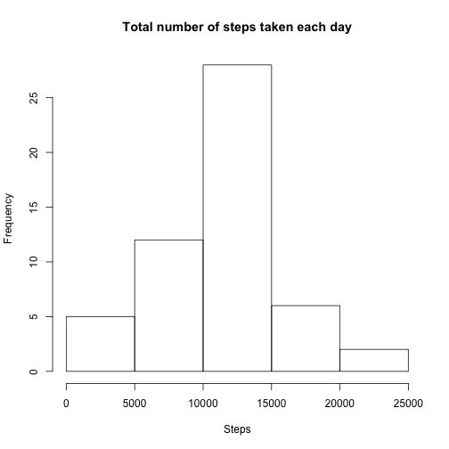
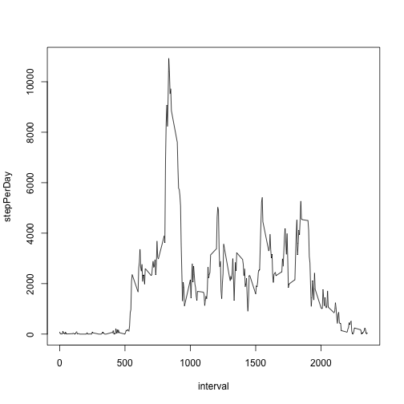
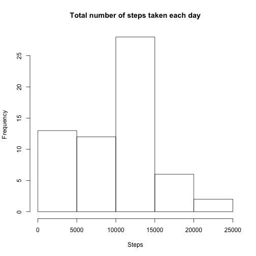
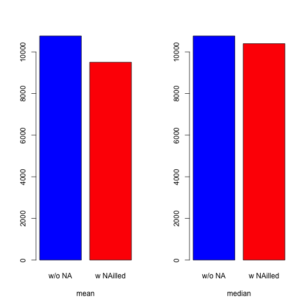
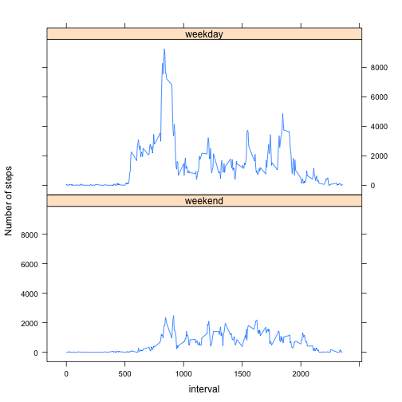

## Loading and preprocessing the data

As the first step we need to load the dataset. Download the **Activity.zip** file in your working directory and load dataset.


```r
data <- read.csv(unz("Activity.zip", "activity.csv"), header = TRUE, sep = ",", na.strings = "NA")
```

Process/transform the data (if necessary) into a format suitable for the analysis:  

- Load useful packages
- Convert the date from *numeric* to *Date* class.
- Remove NA
- Group by date
- Sum all the steps per day into a new variable **stepPerDay**


```r
require(dplyr, quietly = TRUE)
data$date <- as.Date(data$date,"%Y-%m-%d")
Q1 <- data[!is.na(data$steps),] %>% group_by(date) %>% summarize(stepPerDay = sum(steps))
```

## What is mean total number of steps taken per day?

Histogram of the total number of steps taken each day


```r
hist(Q1$stepPerDay,main = "Total number of steps taken each day",xlab = "Steps")
```

 

The mean total number of steps taken per day is:


```r
mean(Q1$stepPerDay)
```

```
## [1] 10766.19
```
The median total number of steps taken per day is:


```r
median(Q1$stepPerDay)
```

```
## [1] 10765
```

## What is the average daily activity pattern?

Time series plot of the 5-minute interval (x-axis) and the average number of steps taken, averaged across all days (y-axis)


```r
Q2 <- data[!is.na(data$steps),] %>% group_by(interval) %>% summarize(stepPerDay = sum(steps))
with(Q2,plot(interval,stepPerDay, type = "l" ))
```

 

The 5-minute interval, on average across all the days in the dataset, containing the maximum number of steps is:


```r
filter(Q2,stepPerDay == max(stepPerDay))
```

```
## Source: local data frame [1 x 2]
## 
##   interval stepPerDay
##      (int)      (int)
## 1      835      10927
```

## Imputing missing values

There are a number of days/intervals where there are missing values (coded as 𝙽𝙰). The presence of missing days may introduce bias into some calculations or summaries of the data.

The total number of missing values in the dataset (i.e. the total number of rows with 𝙽𝙰s) is:


```r
sum(is.na(data$steps))
```

```
## [1] 2304
```

Filling of all the missing values in the dataset. The strategy is the following: use the median for that 5-minute interval. The new dataset is labeled *Q4*


```r
Q3 <- group_by(data[!is.na(data$steps),],interval) %>% summarize(StepsMedian = median(steps))
Q4 <- merge(data,Q3, by.x = "interval")
Q4[is.na(Q4$steps),"steps"] <- Q4[is.na(Q4$steps),"StepsMedian"]
Q4$StepsMedian <- NULL
```

Replicate the preprocessing of the dataset:


```r
Q5 <- group_by(Q4,date) %>% summarize(stepPerDay = sum(steps))
```

New histogram of the total number of steps taken each day:


```r
hist(Q5$stepPerDay,main = "Total number of steps taken each day",xlab = "Steps")
```

 

The new mean total number of steps taken per day is:


```r
mean(Q5$stepPerDay)
```

```
## [1] 9503.869
```

The median total number of steps taken per day is:


```r
median(Q5$stepPerDay)
```

```
## [1] 10395
```

How **median** and **mean** values change filling the missing values in the dataset


```r
par(mfrow=c(1,2))
barplot(c(mean(Q1$stepPerDay),mean(Q5$stepPerDay)), col = c("blue","red"),xlab = "mean",names.arg = c("w/o NA", "w NAilled"))
barplot(c(median(Q1$stepPerDay),median(Q5$stepPerDay)), col = c("blue","red"), xlab = "median",names.arg = c("w/o NA", "w NAilled"))
```

 

So, the impact of imputing missing data on the estimates of the total daily number of steps could be computed.

Effect on the **mean** value as percentage


```r
(mean(Q5$stepPerDay)-mean(Q1$stepPerDay))/mean(Q1$stepPerDay)*100
```

```
## [1] -11.72485
```

Effect on the **median** value as percentage


```r
(median(Q5$stepPerDay)-median(Q1$stepPerDay))/median(Q1$stepPerDay)*100
```

```
## [1] -3.437065
```


## Are there differences in activity patterns between weekdays and weekends?

Create a new factor variable in the dataset with two levels -- "weekday" and "weekend" indicating whether a given date is a weekday or weekend day:


```r
weekdaysList <- c('Monday', 'Tuesday', 'Wednesday', 'Thursday', 'Friday')
Q4$day <- factor((weekdays(Q4$date) %in% weekdaysList), levels=c(FALSE, TRUE), labels=c('weekend', 'weekday')) 
```

Make a panel plot containing a time series plot of the 5-minute interval (x-axis) and the average number of steps taken, averaged across all weekday days or weekend days (y-axis):


```r
require(lattice)
Q6 <- group_by(Q4,day,interval) %>% summarize(StepsSum = sum(steps))
xyplot(StepsSum ~ interval | day, data = Q6, layout = c(1, 2), type="l", ylab = "Number of steps")
```

 

